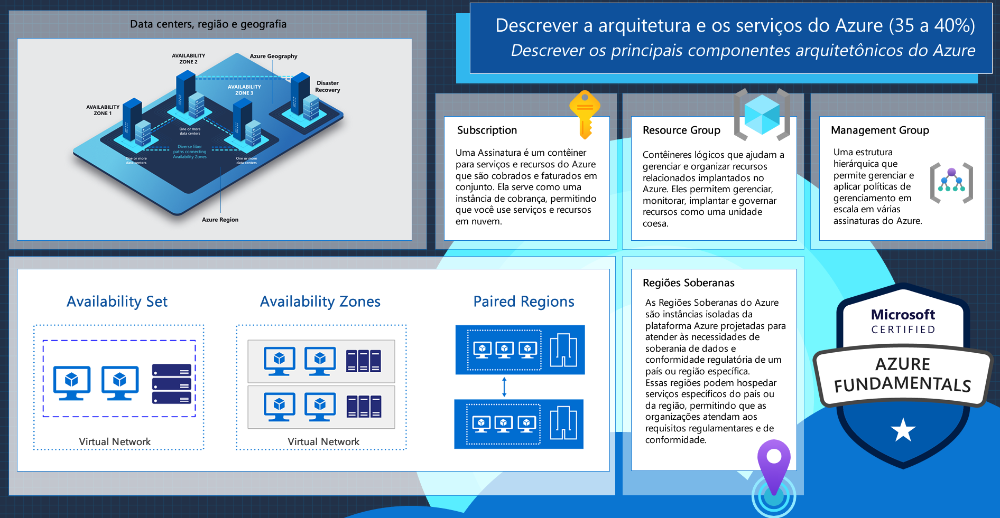
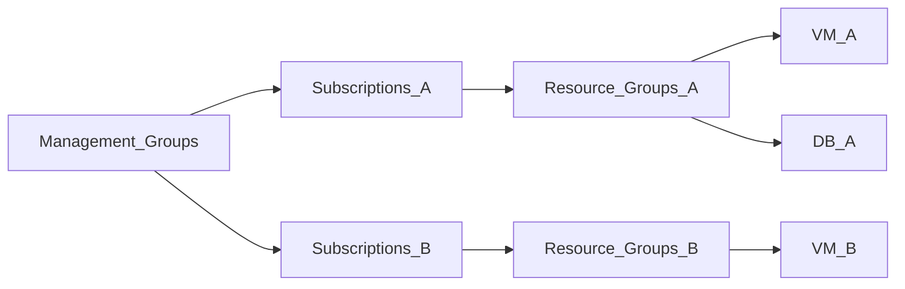

# Arquitetura e serviços do Azure



* ```Regiões```
  * Área geográfica específica que contém um ou mais Datacenters.
    * ```Datacenter```
       * Instalação física que abriga a infraestrutura de TI.
         * ```Zonas de Disponibilidade```
           * Local físico dentro de uma Zona. Cada zona é composta por um ou mais datacenters independentes.

## Grupo de Recursos

Contêineres lógicos que ajudam a organizar e gerenciar os recursos relacionados a um projeto ou aplicativo, podendo ser utilizado para criar ambientes computacionais separados como: Dev, Hml e Prod, por exemplo. 

Características:

* Antes de criar qualquer recurso, primeiro precisamos criar um grupo de Recursos;
* Todos os recursos serão gerenciados em um único local;
* Pode definir políticas de acesso em nível de grupo;
* Vários recursos podem ser criados de uma só vez;
* Ajuda no monitoramento e custos dos recursos utilizados.

**Não existe cobrança para um Grupo de Recursos vazio!!**

Exemplo:




## Subscription(Assinaturas)
É uma forma de se contratar os serviços de computação em nuvem, sendo uma unidade de cobrança da Azure.

---

[Voltar](./README.md)