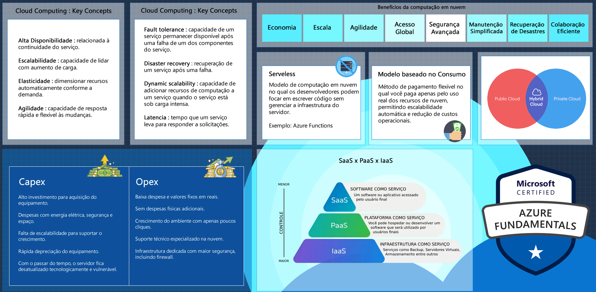
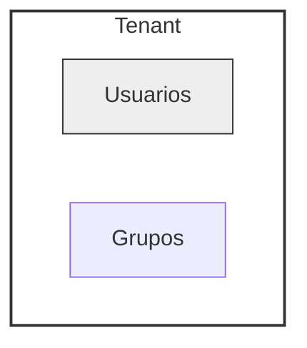

# Identidade, Acesso e Segurança



**Autenticação**  
É o processo de verificar a identidade de um usuário ou serviço que está tentando acessar um recurso ou serviço garantindo que
apenas usuários e serviços legítimos tenham permissão para acessar recursos específicos.

* ```Azure Active DIrectory(Azure AD)```  
    Serviço de gerenciamento de identidades e acessos baseado em nuvem que permite autenticar e autorizar usuários e serviços em aplicativos e recursos do Azure.

* ```Certificados e Chaves```  
    Permite que aplicativos e serviços se autentiquem usando certificados X.509 ou chaves de autenticação(chaves de API) para acessar APIs e recursos protegidos.

* ```Identidades Gerenciadas```  
    Para recursos do Azure, como máquinas virtuais ou aplicativos em execução na plataforma como serviço(PaaS). 

* ```Autenticação Federada```  
    Permite que os usuários usem suas credenciais de identidade existentes, como contas corporativas ou de rede local, para fazer login em aplicativos do Azure. 

**Autorização**  
É o processo de conceder ou negar acesso a recursos ou funcionalidades específicas depois que um usuários ou serviço foi autenticado. Tudo é controlado por meio de políticas.

* ```Azure Role-Based Access Control (RBAC)```  
    Permite atribuir funções a usuários, grupos ou serviços para controlar o acesso a recursos específicos.

* ```Listas de Controle de Acesso(ACL)```  
    Utilizado para recursos de armazenamento, como contas de armazenamento e blobs. ACL's permitem definir permissões específicas em nível de objeto.

* ```Service Principal```  
    Os serviços podem se autenticar e obter tokens de aceso para acessar outros serviços do Azure, seguindo práticas seguras de autenticação de serviço a serviço.

## Microsoft Entra ID

Serviço de gerenciamento de identidade baseado em nuvem da Microsoft, desenvolvido para atender as crescentes demandas de segurança e
gerenciamento de identidades em ambientes digitais.


* ```Autenticação Multifator(MFA)```  
    Adiciona uma camada extra de segurança além das tradicionais senhas.

* ```Single Sign-On(SSO)```  
    Os usuários podem acessar vários serviços e aplicativos com uma única autenticação.

* ```Provisionamento Automático```  
    Facilita o gerenciamento de identidades ao automatizar o provisionamento e a desativação de contas de usuário.

* ```Controle de acesso baseado em funções(RBAC)```  
    Permite que administradores concedam permissões específicas com base nas funções dos usuários.

* ```Integração com aplicativos SaaS```  
    Oferece uma extensa galeria de aplicativos SaaS preconfigurados para integração fácil e rápida.

* ```Gerenciamento de dispositivos```  
    É possível aplicar políticas de segurança a dispositivos registrados, garentindo que apenas dispositivos confiáveis tenham acesso aos recursos da organização.

* ```Relatórios e Análises de Segurança```  
    Fornece recursos avançados de relatórios e análises de segurança, permitindo que as organizações monitorem atividades de logon, identifiquem possíveis ameaças e implementem medidas proativas para proteger suas identidades.

### Tenants
Tenant no Azure é uma representação dedicada e isolada de uma organização no Microsoft Entra ID (anteriormente Azure AD). Pense nele como um espaço privado e seguro para sua organização dentro da nuvem Microsoft Azure. 

**Organização Devopseasybr:**


Na console Azure, no campo de pesquisa digite Microsoft Azure >> Management Tenants >> Create >> Azure Active Directory. Informe o nome da Organização.  

---

[Voltar](./README.md)